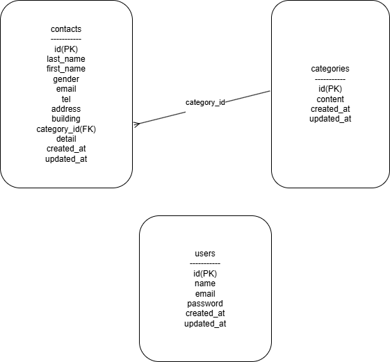

# お問い合わせフォーム

## 環境構築

### Dockerビルド

1. `git clone` でプロジェクトを取得  
2. `cd プロジェクト名`  
3. `docker-compose up -d --build`  

※MySQLはOSや環境によって起動しない場合があるので、各自で `docker-compose.yml` を調整してください。

### Laravel環境構築

1. `docker-compose exec php bash`  
2. `composer install`  
3. `.env.example` をコピーして `.env` を作成し、環境に合わせて編集  
4. `php artisan key:generate`  
5. `php artisan migrate`  
6. `php artisan db:seed`

## 使用技術

- PHP 8.2.29  
- Laravel 8.83.29  
- MySQL 8.0.26  

## URL

- 開発環境: [http://localhost](http://localhost)  
- phpMyAdmin: [http://localhost:8080](http://localhost:8080)  

## アプリケーション概要

- Laravel Fortify によるログイン・登録機能  
- バリデーションはフォームリクエストを使用  
- モーダルウィンドウによる詳細表示・削除  
- お問い合わせ内容は最大120文字制限  
- 検索機能（名前・メール・性別・カテゴリ・日付）  
- 絞り込み検索状態でもCSVエクスポート可能  
- ページネーション機能（1ページあたり7件表示）  
- ダミーデータ生成（contacts: 35件, categories: 5件）  

## 画面構成

- `/`：お問い合わせフォーム  
- `/confirm`：確認画面  
- `/thanks`：送信完了画面  
- `/admin`：管理画面（ログイン必須）  
- `/register`：ユーザー登録画面  
- `/login`：ログイン画面  

## テストユーザー

- メールアドレス：`admin@example.com`  
- パスワード：`password`  

## ER図

## 提出者情報

- 氏名：坂井　理  
- 作成日：2025年7月  
- 所属：COACHTECH確認テスト用  
